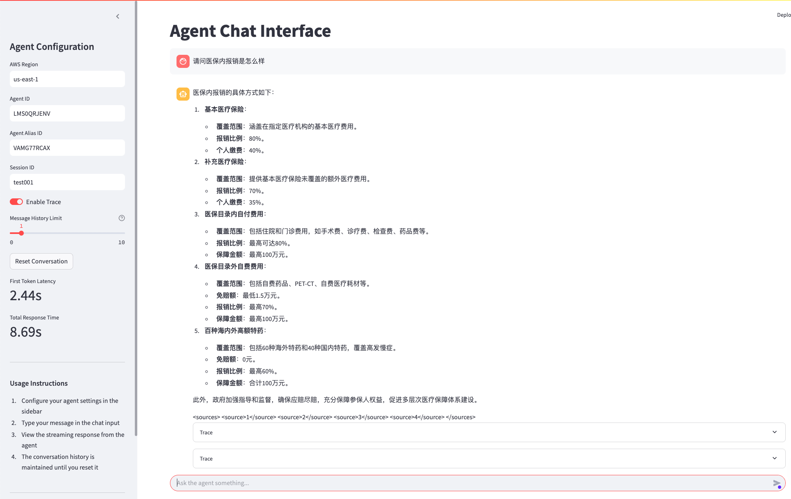

# Agent 测试聊天机器人

这个项目提供了一个基于Streamlit的聊天界面，用于测试AWS Bedrock Agents。

## 功能特点

- 具有流式响应的交互式聊天界面
- 支持Agent ID和模型选择的配置选项
- 会话管理，支持连续对话
- 响应时间指标（首个令牌延迟，总响应时间）
- 对话历史记录及重置功能
- 对轮对话

## 环境设置

### 在Ubuntu中安装Python和pip

1. 更新软件包列表：
```bash
sudo apt update
```

2. 安装软件属性工具（如果尚未安装）：
```bash
sudo apt install software-properties-common
```

3. 添加deadsnakes PPA以获取最新版本的Python：
```bash
sudo add-apt-repository ppa:deadsnakes/ppa
sudo apt update
```

4. 安装Python 3.11及相关工具：
```bash
sudo apt install python3.11 python3.11-venv python3.11-dev
```

5. 安装pip：
```bash
sudo apt install python3-pip
```

6. 验证安装：
```bash
python3.11 --version
pip3 --version
```

### 项目设置

1. 需要python > 3.11 
2. 使用uv安装所需依赖：
```bash
pip install uv

uv sync
```

3. 激活环境
```bash
source .venv/bin/activate
```

4. 配置AWS凭证：
   - 确保您的环境中已配置有效的AWS凭证
   - 用户/角色应具有访问Bedrock Agent Runtime的权限

## 运行应用程序

### 前台运行

使用以下命令在前台运行Streamlit应用程序：

```bash
streamlit run streamlit_agent_chat.py
```

### 后台运行

使用提供的脚本在后台运行应用程序：

```bash
./start_background.sh
```

应用将监听所有网络接口（0.0.0.0），使其可以从其他设备访问。

停止后台运行的应用程序：

```bash
./stop_background.sh
```

后台运行时，日志将保存在`logs`目录中。

## 使用方法

1. 在侧边栏配置您的Agent设置：
   - AWS区域
   - Agent ID
   - 模型选择

2. 在聊天输入框中输入您的消息

3. 查看来自Agent的流式响应

4. 对话历史将保持，直到您使用"重置对话"按钮重置它

## 文件说明

- `streamlit_agent_chat.py`：聊天界面的主要Streamlit应用程序

## 示例
